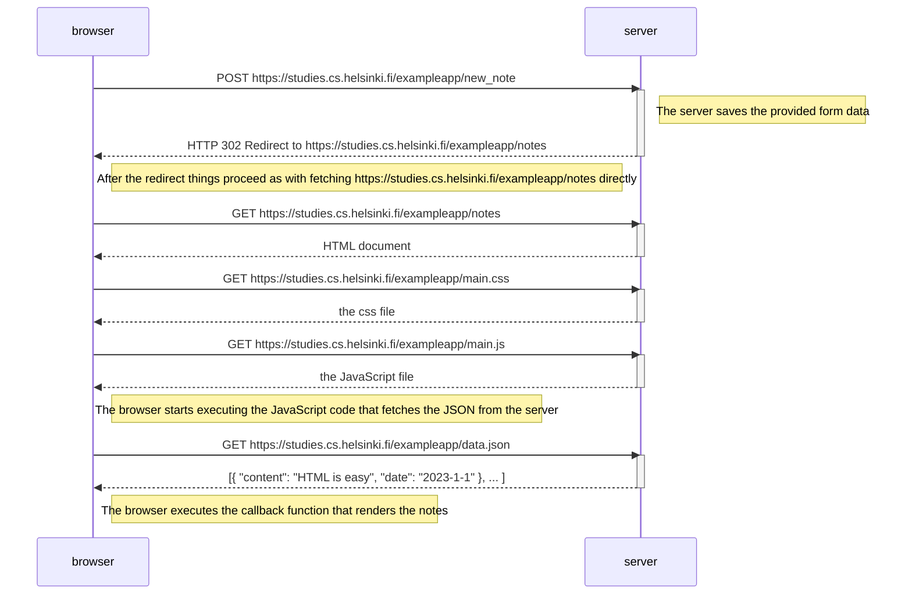
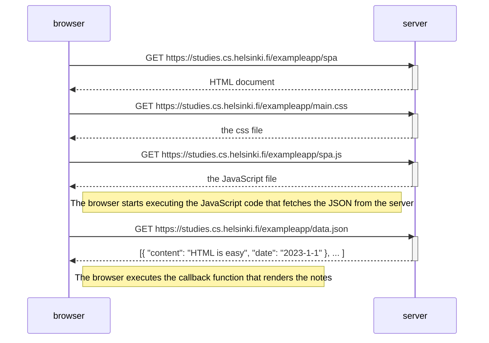
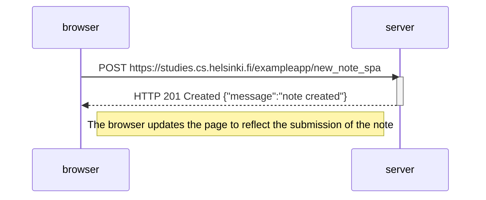

# Solutions to exercises 0.4-0.6

Solutions to Full Stack Open 0.4 to 0.6. Diagrams provided in mermaid syntax

## Solution to exercise 0.4 - New note diagram

The following diagram depicts the situation where the user creates a new note on the page https://studies.cs.helsinki.fi/exampleapp/notes by writing something into the text field and clicking the submit button:

## Solution to exercise 0.5 - Single page app diagram

The following diagram depicts the situation where the user goes to the single-page app version of the notes app at https://studies.cs.helsinki.fi/exampleapp/spa:

## Solution to exercise 0.6 - New note in Single page app diagram

The following diagram depicts the situation where the user creates a new note using the single-page version of the app:

